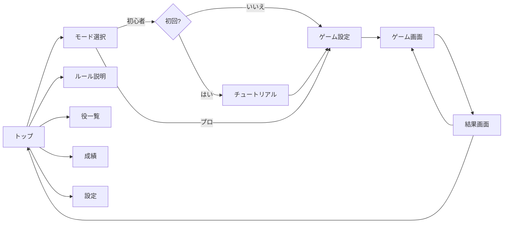
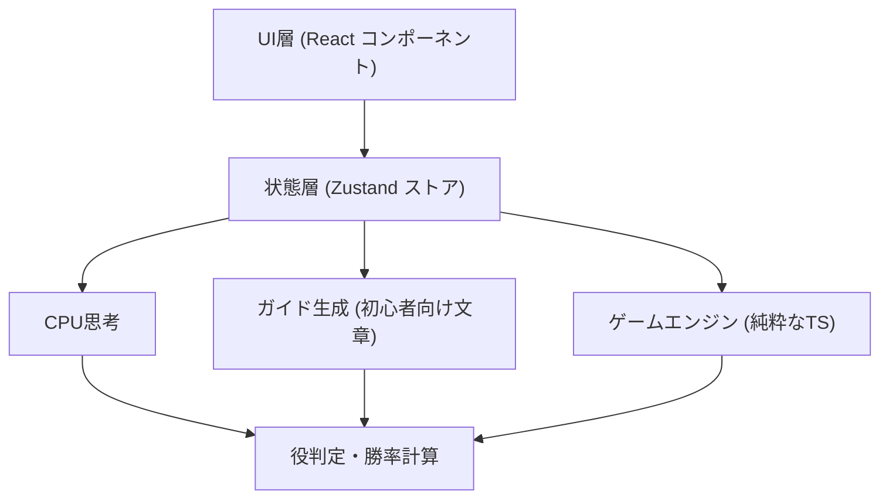
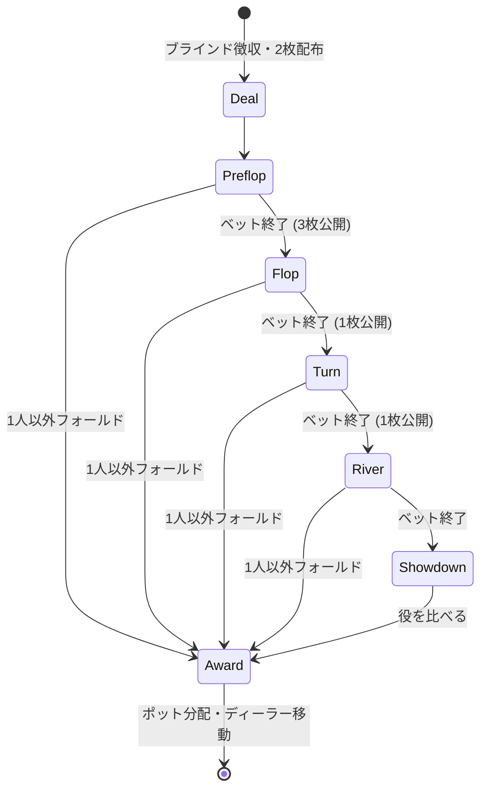
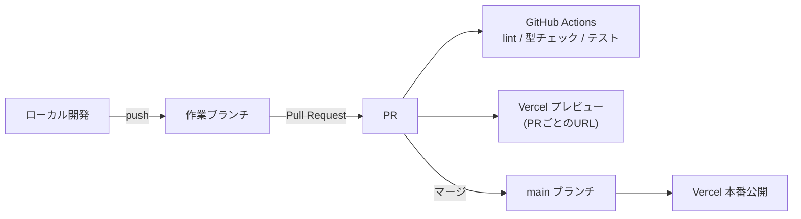

# ポーカーアプリ 設計書 (v0.1 ドラフト)

最終更新: 2026-09-15

---

## 1. 概要

| 項目 | 内容 |
|---|---|
| アプリ名 | **Poker Lesson** |
| ゲーム | テキサス・ホールデム (ノーリミット) |
| 対戦形式 | プレイヤー1人 vs CPU (1〜5人) |
| モード | 初心者モード / プロモード |
| 対象 | ポーカー未経験者〜経験者 |
| 動作環境 | PC・スマホのブラウザ (レスポンシブ) |
| 公開 | GitHub → Vercel |
| 課金・実際のお金 | 扱わない (ゲーム内チップのみ) |

### 1.1 基本方針
- **サーバー不要の構成で始める。** ゲームの処理はすべてブラウザ内で行う。Vercel には静的サイトとして置けるので、費用がかからず運用も簡単。
- **ゲームのロジックと画面を分ける。** ルール処理は UI から独立した TypeScript のコードにして、テストしやすくする。将来オンライン対戦を足すときもそのまま使える。
- **落ち着いたデザインにする。** 派手なエフェクトやカジノ風の装飾は使わない。

### 1.2 テキサス・ホールデムを選ぶ理由
- 世界的に一番遊ばれていて、学ぶ価値が高い
- 手札2枚＋共通カード5枚という形なので、「今どういう状況か」を説明しやすい

---

## 2. モード仕様

### 2.1 初心者モード
ルールの説明を受けながら、実際に1ゲームを進められるモード。

| 機能 | 内容 |
|---|---|
| **ガイドパネル** | 今の段階 (プリフロップ/フロップ/ターン/リバー/ショーダウン) に合わせて「今何が起きているか」「あなたは何ができるか」を表示 |
| **アクション説明** | フォールド/チェック/コール/ベット/レイズ/オールインの各ボタンに、押す前に意味が分かる説明を付ける (長押し/ホバー、または「?」アイコン) |
| **現在の役表示** | 自分の手札と場のカードで今できている役を常に表示し、使われているカードを強調する (例: 「ワンペア (Kのペア)」) |
| **おすすめアクション** | 「おすすめ: コール」と理由を1行で表示 (例: 「ワンペアがあり、コールに必要な額が小さいため」)。表示のON/OFFを切り替え可能 |
| **強さメーター** | 手の強さを「弱い/ふつう/強い/とても強い」の4段階で表示 |
| **うっかりフォールド防止** | チェックできるのにフォールドしようとしたとき、または強い役でフォールドしようとしたときに確認を出す |
| **ハンド後の振り返り** | 勝敗の理由 (誰がどの役で勝ったか) を、比べたカードを並べて説明 |
| **役一覧** | いつでも開ける役の早見表 (強い順・具体例付き) |
| **チュートリアル** | 初回のみ、決まったカードで進む3ハンド分の練習 (ブラインド → 役 → ベットの順に学ぶ) |
| **CPUの強さ** | 弱め固定。無茶なブラフはあまりしない |
| **テンポ** | ゆっくり。CPUの行動ごとに「CPU1 がコールしました (10チップ払いました)」と文章で表示 |
| **チップが尽きたとき** | 何度でもチップを補充して続けられる |

### 2.2 プロモード
説明なしで、テンポよく本格的に遊ぶモード。

| 機能 | 内容 |
|---|---|
| **ヒントなし** | ガイド・おすすめ・役表示はすべて非表示 (役表示だけは設定でONにできる) |
| **ベット操作** | スライダー＋プリセット (1/3ポット、1/2ポット、ポット、オールイン) |
| **ポットオッズ表示** | 設定でON/OFF。「コールに必要な勝率」を数値で表示 |
| **CPUの強さ** | ふつう / 強い の2段階から選択 |
| **形式** | キャッシュゲーム (ブラインド固定) / トーナメント (一定ハンドごとにブラインドが上がる。最後の1人になれば勝ち) |
| **持ち時間** | 任意でON (15秒/30秒)。時間切れならチェック、チェックできなければフォールド |
| **ハンド履歴** | 直近50ハンドのアクションを記録し、あとから見返せる |
| **成績** | 勝率、収支、VPIP (自分から参加した割合)、PFR (プリフロップでレイズした割合) |
| **テンポ** | アニメーション短め。設定で「アニメーションなし」も選べる |

### 2.3 共通仕様
- CPUの人数: 1〜5人 (初期値3人)
- 最初のチップ: 1,000 / ブラインド: 5 / 10 (初期値。設定で変更可)
- 設定と成績はブラウザ内 (localStorage) に保存。ログインは不要
- 途中でタブを閉じても、続きからハンドを再開できる
- 日本語UI (将来の英語対応を考え、文言は1か所にまとめて管理する)

---

## 3. 画面構成



| 画面 | パス | 主な内容 |
|---|---|---|
| トップ | `/` | 「はじめる」ボタン、ルール・役一覧・成績・設定へのリンク |
| モード選択 | `/play` | 初心者/プロの2枚のカード。それぞれの特徴を一言で説明 |
| ゲーム設定 | `/play/setup` | CPU人数、CPUの強さ、形式、ブラインド、持ち時間 |
| ゲーム | `/play/game` | テーブル本体 (4章) |
| チュートリアル | `/tutorial` | 決まったカードで進むガイド付きゲーム |
| ルール説明 | `/rules` | 流れ・用語・ポジションを図入りで説明 |
| 役一覧 | `/hands` | 10種類の役の早見表 |
| 成績 | `/stats` | モード別の成績、ハンド履歴 |
| 設定 | `/settings` | テーマ(ライト/ダーク)、4色デッキ、アニメーション、効果音、データ初期化 |

---

## 4. ゲーム画面レイアウト

### 4.1 PC (横長)
```
┌──────────────────────────────────────────────────────────┐
│ ← 戻る        ブラインド 5/10   ハンド #12        ⚙ ?   │
├───────────────────────────────────────────┬──────────────┤
│              CPU2 [🂠🂠] 980                 │  ガイド       │
│    CPU1 [🂠🂠] 1,120          CPU3 [🂠🂠] 760  │ (初心者のみ)  │
│                                           │              │
│        ┌─────────────────────────┐        │ 今はフロップ │
│        │  A♠  K♥  7♦  [ ]  [ ]   │        │ 場に3枚…     │
│        │       ポット: 240        │        │              │
│        └─────────────────────────┘        │ おすすめ:    │
│                                           │ チェック     │
│         あなた (D)  [A♥][Q♣]  1,040       │              │
│          役: ワンペア (A)  強さ ■■■□      │ [役一覧]     │
├───────────────────────────────────────────┴──────────────┤
│   [フォールド]   [チェック]   [ベット 20 ────●──── ]  [確定] │
└──────────────────────────────────────────────────────────┘
```

### 4.2 スマホ (縦長)
- テーブルは楕円ではなく縦に並べる (上にCPU、中央に場のカード、下に自分)
- ガイドパネルは画面下から引き出す形 (初期状態では1行の要約だけ表示)
- 操作ボタンは親指で押しやすいよう画面下に固定し、高さ48px以上にする

---

## 5. デザイン方針

### 5.1 トーン
- **落ち着いた、清潔感のある見た目。** 金色の装飾、ネオン、光る演出などカジノ風のものは使わない
- テーブルは深めの落ち着いた緑。まわりは白に近い色 (ライト) か墨色 (ダーク)
- 強調色 (アクセント) は1色だけにして、「今押すべきボタン」だけに使う

### 5.2 カラー (案)
| 用途 | ライト | ダーク |
|---|---|---|
| 背景 | `#F7F7F5` | `#17191C` |
| 面 (パネル) | `#FFFFFF` | `#22252A` |
| テーブル | `#2F5D50` | `#264B41` |
| 文字 | `#1F2328` | `#E6E8EB` |
| 補助文字 | `#5B636E` | `#9AA3AE` |
| アクセント | `#2F6FEB` | `#5B8DEF` |
| 注意 (フォールド等) | `#B4443C` | `#D46A62` |

### 5.3 カード
- 白地にシンプルな記号。♥♦ は赤、♠♣ は黒
- **4色デッキ** (♦ 青、♣ 緑) を設定で選べるようにし、見間違いを防ぐ
- 色だけに頼らず、必ずマーク (♠♥♦♣) も表示する

### 5.4 文字・動き
- フォント: Noto Sans JP (Google Fonts)。数字は桁がそろう表示 (tabular-nums)
- アニメーションは短く (150〜250ms)、カードを配る・めくる・チップが動くの3種類だけ
- OSの「視差効果を減らす」設定がONなら、アニメーションを止める

### 5.5 アクセシビリティ
- 文字と背景のコントラスト比は 4.5:1 以上
- キーボードで操作できる (F: フォールド、C: チェック/コール、R: レイズ)
- 画面読み上げ向けに、CPUの行動を文章で通知する (aria-live)

---

## 6. 技術構成

| 分類 | 採用 | 理由 |
|---|---|---|
| フレームワーク | **Next.js 16 (App Router)** | Vercel と相性が良い。将来API (オンライン対戦など) を足しやすい |
| 言語 | TypeScript | ルールの処理が複雑なので型で間違いを防ぐ |
| スタイル | Tailwind CSS | デザインの値 (色・余白) を1か所で管理しやすい |
| 状態管理 | Zustand | 小さくて分かりやすい。ゲームの状態を1つのストアで持つ |
| テスト | Vitest (ロジック) / Playwright (画面操作) | 役判定・ポット計算は特に丁寧にテストする |
| 重い計算 | Web Worker | 勝率計算 (モンテカルロ) で画面が固まらないようにする |
| 品質チェック | ESLint + Prettier | |
| パッケージ管理 | npm | Node.js に最初から入っていて、追加のインストールが不要 |

---

## 7. アーキテクチャ

### 7.1 レイヤー構成



- **engine**: ルールだけを担当。React に依存しない。`(状態, アクション) → 新しい状態` という形の関数で作る
- **ai**: 状態を見て、CPUの次の行動を決める
- **guide**: 状態を見て、初心者向けの説明文とおすすめアクションを作る
- **store**: engine・ai・guide をつなぎ、UI に渡す

### 7.2 ディレクトリ構成

```
ポーカーアプリ/
├─ docs/
│  └─ DESIGN.md
├─ src/
│  ├─ app/                      # Next.js の画面 (ルーティング)
│  │  ├─ page.tsx               # トップ
│  │  ├─ play/page.tsx          # モード選択
│  │  ├─ play/setup/page.tsx
│  │  ├─ play/game/page.tsx
│  │  ├─ tutorial/page.tsx
│  │  ├─ rules/page.tsx
│  │  ├─ hands/page.tsx
│  │  ├─ stats/page.tsx
│  │  └─ settings/page.tsx
│  ├─ components/
│  │  ├─ table/                 # Table, Seat, Board, Pot, PlayingCard
│  │  ├─ controls/              # ActionBar, BetSlider
│  │  ├─ guide/                 # GuidePanel, HandStrengthMeter, HintBadge
│  │  └─ ui/                    # Button, Dialog, Tooltip などの共通部品
│  ├─ engine/
│  │  ├─ cards.ts               # カード・デッキ・シャッフル
│  │  ├─ evaluator.ts           # 役判定
│  │  ├─ betting.ts             # ベットのルール・次の手番
│  │  ├─ pots.ts                # サイドポット計算
│  │  ├─ game.ts                # 進行 (reducer)
│  │  └─ types.ts
│  ├─ ai/
│  │  ├─ cpu.ts                 # 強さ別の思考
│  │  └─ equity.worker.ts       # 勝率計算 (Web Worker)
│  ├─ guide/
│  │  ├─ explain.ts             # 状況説明文の生成
│  │  └─ recommend.ts           # おすすめアクション
│  ├─ store/
│  │  ├─ gameStore.ts
│  │  └─ settingsStore.ts
│  ├─ content/
│  │  └─ ja.ts                  # 文言をまとめたファイル
│  └─ lib/
│     └─ storage.ts             # localStorage の読み書き
├─ tests/
│  ├─ engine/                   # Vitest
│  └─ e2e/                      # Playwright
├─ public/
├─ .github/workflows/ci.yml
└─ package.json
```

### 7.3 主なデータ型 (抜粋)

```ts
type Suit = 's' | 'h' | 'd' | 'c';
type Rank = 2|3|4|5|6|7|8|9|10|11|12|13|14; // 11=J … 14=A
type Card = { rank: Rank; suit: Suit };

type Street = 'preflop' | 'flop' | 'turn' | 'river' | 'showdown';
type Mode = 'beginner' | 'pro';

type ActionType = 'fold' | 'check' | 'call' | 'bet' | 'raise' | 'allin';
type Action = { playerId: string; type: ActionType; amount?: number };

type Player = {
  id: string;
  name: string;
  isHuman: boolean;
  stack: number;          // 手持ちチップ
  holeCards: Card[];      // 手札2枚
  currentBet: number;     // このストリートで出した額
  totalBet: number;       // このハンドで出した合計 (サイドポット計算用)
  status: 'active' | 'folded' | 'allin' | 'out';
  cpuLevel?: 'easy' | 'normal' | 'hard';
};

type Pot = { amount: number; eligiblePlayerIds: string[] };

type GameState = {
  mode: Mode;
  handNumber: number;
  street: Street;
  deck: Card[];
  board: Card[];          // 場のカード 0〜5枚
  players: Player[];
  dealerIndex: number;
  toActIndex: number;
  minRaise: number;
  pots: Pot[];
  blinds: { small: number; big: number };
  log: Action[];
};

type HandRank = {
  category: 0|1|2|3|4|5|6|7|8|9;  // 0=ハイカード … 9=ロイヤルフラッシュ
  tiebreak: number[];              // 同じ役どうしの比較用
  bestFive: Card[];                // 役に使った5枚 (強調表示に使う)
};
```

### 7.4 ハンドの進行



- 全員がオールインになったら、残りのカードを自動で開けてショーダウンへ進む
- ヘッズアップ (2人) のときはディーラーがスモールブラインドになる、という特別ルールも入れる

### 7.5 ルール処理で気をつける点
| 項目 | 方針 |
|---|---|
| シャッフル | `crypto.getRandomValues` を使った Fisher–Yates 法。チュートリアルやテストでは種(シード)を固定できるようにする |
| 役判定 | 7枚から5枚を選ぶ21通りをすべて評価し、一番強いものを採用。A-2-3-4-5 のストレートも扱う |
| 最小レイズ | 直前のベット/レイズの増加分以上 |
| 足りないオールイン | 最小レイズに届かないオールインでは、他の人のレイズ権を復活させない |
| サイドポット | 各プレイヤーの `totalBet` を少ない順に区切って作る |
| 端数 | ポットを割り切れないときは、ディーラーから左回りで最初の勝者に端数を渡す |

---

## 8. CPU の思考

| 強さ | 使うモード | 考え方 |
|---|---|---|
| 弱い (easy) | 初心者 | 手の強さ (4段階) だけで決める。ブラフはほぼしない。少しランダムに動く |
| ふつう (normal) | プロ | プリフロップは手札の表でスタートを決める。フロップ以降は勝率とポットオッズを比べる。時々ブラフ |
| 強い (hard) | プロ | ふつうに加えて、ポジション (座る位置)、相手の人数、ベット額の大小を考える。ブラフとベット額にばらつきを持たせる |

- 勝率はモンテカルロ法 (1回の判断で約2,000回ランダムに試す) を Web Worker で計算
- 人間らしく見えるよう、行動の前に 0.6〜1.5秒の「考える時間」を置く (プロモードでは短め)

---

## 9. 初心者ガイドの作り方

ガイドは **決まった文章のテンプレート＋状況に合わせた値の差し込み** で作る (AIによる文章生成は使わない。オフラインで動き、内容が毎回ぶれない)。

| きっかけ | 表示例 |
|---|---|
| ハンド開始 | 「あなたはディーラーの左2つ目なので、ビッグブラインド (10チップ) を自動で出しました」 |
| 自分の番 (プリフロップ) | 「今は手札2枚だけで勝負を続けるか決める段階です。10チップ払えば次に進めます」 |
| フロップ公開 | 「場に3枚開きました。手札2枚と合わせて、一番強い5枚で役を作ります」 |
| 役ができた | 「A♥ と場の A♠ でワンペアができました」 |
| CPUがレイズ | 「CPU2 が 40 にレイズしました。続けるには 30 追加で払う必要があります」 |
| ショーダウン | 「CPU1 はツーペア、あなたはワンペア。ツーペアの方が強いので CPU1 の勝ちです」 |

**おすすめアクションの考え方 (簡易版)**
1. チェックできるなら、弱い手はチェックをすすめる
2. 勝率がポットオッズ (払う額 ÷ 払った後のポット) より高ければコールをすすめる
3. 勝率がかなり高い (目安 65%以上) ならベット/レイズをすすめる
4. どれにも当てはまらなければフォールドをすすめる

※ 学習のための目安であり、「必ず正しい手」ではないことをガイド内に書いておく。

---

## 10. データの保存

| キー | 中身 |
|---|---|
| `poker.settings.v1` | テーマ、4色デッキ、アニメーション、効果音、ヒント表示 |
| `poker.stats.v1` | モード別の成績 |
| `poker.history.v1` | 直近50ハンドの履歴 |
| `poker.session.v1` | 進行中ゲームの状態 (再開用) |
| `poker.tutorialDone.v1` | チュートリアル完了フラグ |

- キーにバージョン番号 (`v1`) を付け、形を変えるときに古いデータを変換できるようにする
- 読み込みに失敗しても (プライベートブラウズなど) 初期値で動くようにする

---

## 11. 公開の流れ (GitHub → Vercel)



### 手順
1. GitHub にリポジトリを作成 (例: `poker-app`) して push
2. Vercel で「Add New → Project」から GitHub リポジトリを読み込む (Next.js は自動で認識される)
3. 以後、`main` に入った変更は本番へ、PR ごとに確認用URLが自動で作られる
4. GitHub Actions では `npm run lint` / `npm run typecheck` / `npm test` / `npm run build` を実行し、失敗したらマージできないようにする (ブランチ保護)

### 補足
- 環境変数は現段階では不要 (サーバー処理がないため)
- 独自ドメインは必要になったら Vercel の設定で追加
- 解析を入れる場合は Vercel Analytics (Cookie不要) を想定

---

## 12. 開発の進め方

| 段階 | 内容 | 完了の目安 |
|---|---|---|
| **M0 準備** | Next.js 雛形、Tailwind、CI、Vercel 連携 | 空のトップページが本番URLで見られる |
| **M1 エンジン** | カード・役判定・ベット・サイドポット・進行 | テストが通る (役判定は全カテゴリ・引き分け・A始まりストレートを含む) |
| **M2 対戦できる** | テーブル画面、操作バー、弱いCPU | ブラウザで最後まで遊べる |
| **M3 初心者モード** | ガイドパネル、役表示、おすすめ、振り返り、役一覧、ルール説明 | 未経験者が説明を見ながら1ハンド終えられる |
| **M4 プロモード** | ふつう/強いCPU、ベットプリセット、ポットオッズ、トーナメント、持ち時間 | |
| **M5 仕上げ** | チュートリアル、成績・履歴、設定、ダークモード、スマホ調整、アクセシビリティ | Lighthouse でアクセシビリティ 90点以上 |
| **将来** | 英語対応、PWA (オフライン/ホーム画面追加)、オンライン対戦 | |

---

## 13. 決定事項 (2026-09-15)

| # | 項目 | 決定 |
|---|---|---|
| 1 | ゲームの種類 | テキサス・ホールデムのみ (他の種類は将来) |
| 2 | 対戦相手 | CPU対戦のみ (オンライン対戦は将来) |
| 3 | フレームワーク | Next.js |
| 4 | アプリ名 | **Poker Lesson** |
| 5 | 効果音 | 入れる。ON/OFF を切り替え可能 (14章) |
| 6 | 注意書き | トップ画面に「実際のお金を賭けるものではありません」を表示 |

---

## 14. 効果音

| 項目 | 内容 |
|---|---|
| 鳴らす場面 | カードを配る / カードをめくる / チップを出す / 自分の番が来た / ハンドに勝った |
| 音の方針 | 短く (0.3秒以内)、控えめな音量。ファンファーレのような派手な音は使わない |
| ON/OFF | 設定画面と、ゲーム画面のヘッダーにあるスピーカーアイコンの両方から切り替え可能 |
| 初期状態 | OFF (ブラウザは操作前の音声再生を制限するため。また、突然音が出ないようにするため) |
| 音量 | 設定画面で3段階 (小/中/大) |
| 保存 | `poker.settings.v1` の `sound: { enabled, volume }` |
| 実装 | Web Audio API。音声ファイルは `public/sounds/` に置く (合計 200KB 以内) |

---

## 15. 注意書き

- トップ画面の下部に「このアプリはゲームです。実際のお金を賭けるものではありません。」と表示する
- 目立たせすぎず、補助文字の色で常に見える位置に置く
